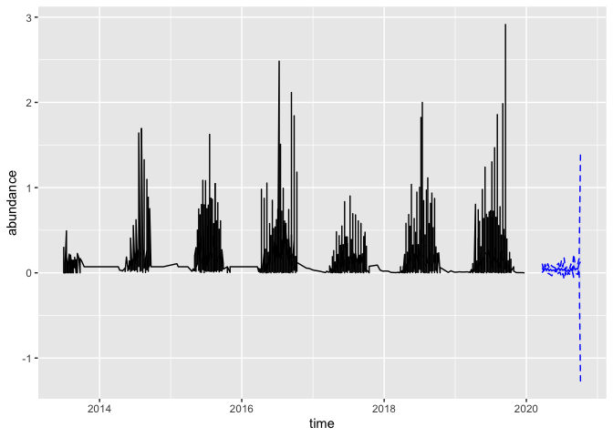
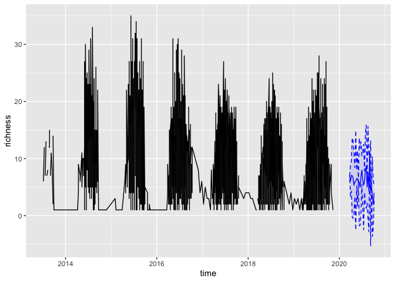
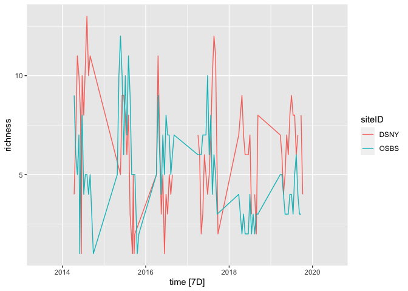
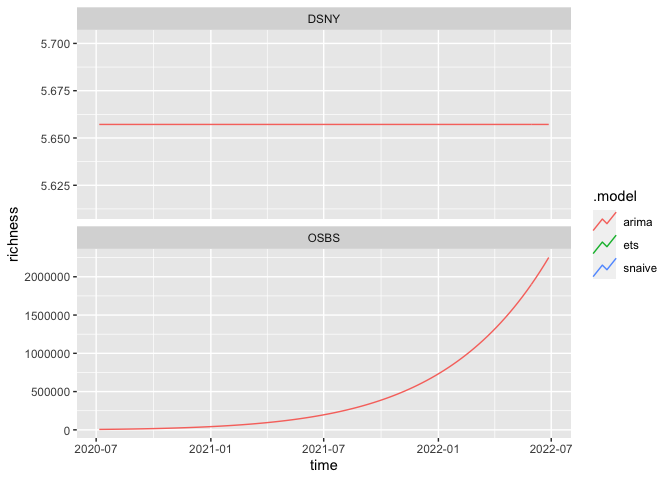

data-exploration
================
Millie Chapman
1/29/2021

``` r
library(tidyverse)
```

    ## ── Attaching packages ─────────────────────────────────────── tidyverse 1.3.0 ──

    ## ✓ ggplot2 3.3.2     ✓ purrr   0.3.4
    ## ✓ tibble  3.0.4     ✓ dplyr   1.0.2
    ## ✓ tidyr   1.1.2     ✓ stringr 1.4.0
    ## ✓ readr   1.4.0     ✓ forcats 0.5.0

    ## ── Conflicts ────────────────────────────────────────── tidyverse_conflicts() ──
    ## x dplyr::filter() masks stats::filter()
    ## x dplyr::lag()    masks stats::lag()

``` r
library(ISOweek) 
library(forecast)
```

    ## Registered S3 method overwritten by 'quantmod':
    ##   method            from
    ##   as.zoo.data.frame zoo

``` r
library(fable)
```

    ## Loading required package: fabletools

    ## 
    ## Attaching package: 'fabletools'

    ## The following objects are masked from 'package:forecast':
    ## 
    ##     accuracy, forecast

``` r
library(tsibble)
library(tsibbledata)
library(lubridate)
```

    ## 
    ## Attaching package: 'lubridate'

    ## The following object is masked from 'package:tsibble':
    ## 
    ##     interval

    ## The following objects are masked from 'package:base':
    ## 
    ##     date, intersect, setdiff, union

``` r
#> Warning: package 'lubridate' was built under R version 3.6.3
library(dplyr)
```

Null forecast function

``` r
null_forecast <- function(targets, forecast_year = 2020){
  ## Forecast is just based on historic mean/sd by siteID & week
  model <- targets %>% 
    mutate(iso_week = ISOweek::date2ISOweek(time)) %>%
    separate(iso_week, into = c("year", "week", "day")) %>%
    filter(year < forecast_year) %>%
    group_by(week, siteID) %>%
    summarize(mean_richness = mean(richness, na.rm = TRUE),
              sd_richness = sd(richness, na.rm = TRUE),
              mean_abundance = mean(abundance, na.rm = TRUE),
              sd_abundance = sd(abundance, na.rm = TRUE)
              ) %>% 
    mutate(sd_richness = replace_na(sd_richness, mean(sd_richness, na.rm=TRUE)),
           sd_abundance = replace_na(sd_abundance, mean(sd_abundance, na.rm=TRUE)),
          ) %>% 
    mutate(year = forecast_year)

  ### Express forecasts in terms of replicates instead of analytic mean, sd.
  ### This allows for scoring using CRPS, and generalizes to MCMC-based forecasts
  mcmc_samples <- function(df, n_reps = 500){
    map_dfr(1:nrow(df), 
            function(i) 
              data.frame(siteID = df$siteID[[i]],
                         time = ISOweek::ISOweek2date(paste(df$year[[i]], 
                                                            df$week[[i]], 
                                                            "1", sep = "-")),
                         ensemble = 1:n_reps, 
                         richness = rnorm(n_reps, 
                                          df$mean_richness[[i]], 
                                          df$sd_richness[[i]]),
                         abundance = rnorm(n_reps,
                                           df$mean_abundance[[i]],
                                           df$sd_abundance[[i]])
                         
                        )
            )
  }
  
  n_reps <- 500
  forecast <- mcmc_samples(model, n_reps)
}
```

``` r
## Get the latest beetle target data.  
download.file("https://data.ecoforecast.org/targets/beetles/beetles-targets.csv.gz",
              "beetles-targets.csv.gz")
targets <-  read_csv("beetles-targets.csv.gz")
```

    ## 
    ## ── Column specification ────────────────────────────────────────────────────────
    ## cols(
    ##   siteID = col_character(),
    ##   time = col_date(format = ""),
    ##   abundance = col_double(),
    ##   richness = col_double()
    ## )

``` r
## Make the forecast
forecast <- null_forecast(targets)
```

    ## `summarise()` regrouping output by 'week' (override with `.groups` argument)

    ## Warning in rnorm(n_reps, df$mean_richness[[i]], df$sd_richness[[i]]): NAs
    ## produced

    ## Warning in rnorm(n_reps, df$mean_abundance[[i]], df$sd_abundance[[i]]): NAs
    ## produced

    ## Warning in rnorm(n_reps, df$mean_richness[[i]], df$sd_richness[[i]]): NAs
    ## produced
    
    ## Warning in rnorm(n_reps, df$mean_richness[[i]], df$sd_richness[[i]]): NAs
    ## produced
    
    ## Warning in rnorm(n_reps, df$mean_richness[[i]], df$sd_richness[[i]]): NAs
    ## produced
    
    ## Warning in rnorm(n_reps, df$mean_richness[[i]], df$sd_richness[[i]]): NAs
    ## produced
    
    ## Warning in rnorm(n_reps, df$mean_richness[[i]], df$sd_richness[[i]]): NAs
    ## produced
    
    ## Warning in rnorm(n_reps, df$mean_richness[[i]], df$sd_richness[[i]]): NAs
    ## produced

    ## Warning in rnorm(n_reps, df$mean_abundance[[i]], df$sd_abundance[[i]]): NAs
    ## produced

    ## Warning in rnorm(n_reps, df$mean_richness[[i]], df$sd_richness[[i]]): NAs
    ## produced

    ## Warning in rnorm(n_reps, df$mean_abundance[[i]], df$sd_abundance[[i]]): NAs
    ## produced

    ## Warning in rnorm(n_reps, df$mean_richness[[i]], df$sd_richness[[i]]): NAs
    ## produced

    ## Warning in rnorm(n_reps, df$mean_abundance[[i]], df$sd_abundance[[i]]): NAs
    ## produced

    ## Warning in rnorm(n_reps, df$mean_richness[[i]], df$sd_richness[[i]]): NAs
    ## produced

    ## Warning in rnorm(n_reps, df$mean_abundance[[i]], df$sd_abundance[[i]]): NAs
    ## produced

    ## Warning in rnorm(n_reps, df$mean_richness[[i]], df$sd_richness[[i]]): NAs
    ## produced

    ## Warning in rnorm(n_reps, df$mean_abundance[[i]], df$sd_abundance[[i]]): NAs
    ## produced

    ## Warning in rnorm(n_reps, df$mean_richness[[i]], df$sd_richness[[i]]): NAs
    ## produced

    ## Warning in rnorm(n_reps, df$mean_abundance[[i]], df$sd_abundance[[i]]): NAs
    ## produced

    ## Warning in rnorm(n_reps, df$mean_richness[[i]], df$sd_richness[[i]]): NAs
    ## produced

    ## Warning in rnorm(n_reps, df$mean_abundance[[i]], df$sd_abundance[[i]]): NAs
    ## produced

    ## Warning in rnorm(n_reps, df$mean_richness[[i]], df$sd_richness[[i]]): NAs
    ## produced

    ## Warning in rnorm(n_reps, df$mean_abundance[[i]], df$sd_abundance[[i]]): NAs
    ## produced

    ## Warning in rnorm(n_reps, df$mean_richness[[i]], df$sd_richness[[i]]): NAs
    ## produced

    ## Warning in rnorm(n_reps, df$mean_abundance[[i]], df$sd_abundance[[i]]): NAs
    ## produced

    ## Warning in rnorm(n_reps, df$mean_richness[[i]], df$sd_richness[[i]]): NAs
    ## produced

    ## Warning in rnorm(n_reps, df$mean_abundance[[i]], df$sd_abundance[[i]]): NAs
    ## produced

    ## Warning in rnorm(n_reps, df$mean_richness[[i]], df$sd_richness[[i]]): NAs
    ## produced

    ## Warning in rnorm(n_reps, df$mean_abundance[[i]], df$sd_abundance[[i]]): NAs
    ## produced

    ## Warning in rnorm(n_reps, df$mean_richness[[i]], df$sd_richness[[i]]): NAs
    ## produced

    ## Warning in rnorm(n_reps, df$mean_abundance[[i]], df$sd_abundance[[i]]): NAs
    ## produced

``` r
forecast <- forecast %>%
  group_by(time, siteID) %>%
  summarise(lower_abundance = quantile(abundance, 0.025, na.rm = TRUE),
            upper_abundance = quantile(abundance, 0.975, na.rm = TRUE),
            lower_richness = quantile(richness, 0.025, na.rm = TRUE),
            upper_richness = quantile(richness, 0.975, na.rm = TRUE),
            abundance = mean(abundance, na.rm = TRUE),
            richness = mean(richness, na.rm = TRUE))
```

    ## `summarise()` regrouping output by 'time' (override with `.groups` argument)

``` r
targets %>% 
    mutate(iso_week = ISOweek::date2ISOweek(time)) %>%
    separate(iso_week, into = c("year", "week", "day")) %>%
    filter(year < 2020) %>%
    group_by(week, siteID) %>%
    summarize(mean_richness = mean(richness, na.rm = TRUE),
              sd_richness = sd(richness, na.rm = TRUE),
              mean_abundance = mean(abundance, na.rm = TRUE),
              sd_abundance = sd(abundance, na.rm = TRUE)
              ) %>% 
    mutate(sd_richness = replace_na(sd_richness, mean(sd_richness, na.rm=TRUE)),
           sd_abundance = replace_na(sd_abundance, mean(sd_abundance, na.rm=TRUE)),
          ) %>% 
    mutate(year = 2020)
```

    ## `summarise()` regrouping output by 'week' (override with `.groups` argument)

    ## # A tibble: 887 x 7
    ## # Groups:   week [46]
    ##    week  siteID mean_richness sd_richness mean_abundance sd_abundance  year
    ##    <chr> <chr>          <dbl>       <dbl>          <dbl>        <dbl> <dbl>
    ##  1 W02   SJER            3           1           0.0190       0.0109   2020
    ##  2 W04   SJER            3.33        1.53        0.0185       0.00604  2020
    ##  3 W06   SJER            3           0           0.0109       0.00636  2020
    ##  4 W06   STER            3           0           0.107        0.00636  2020
    ##  5 W07   STER            1         NaN           0.0714     NaN        2020
    ##  6 W08   SJER            2           1           0.00757      0.00346  2020
    ##  7 W08   STER            1           1           0.0714       0.00346  2020
    ##  8 W10   SJER            1.67        1.15        0.00587      0.00525  2020
    ##  9 W11   CLBJ            3.33        4.04        0.0113       0.00722  2020
    ## 10 W12   OAES            3           1.15        0.00595      0.00842  2020
    ## # … with 877 more rows

``` r
targets_plot <- targets %>% 
    mutate(iso_week = ISOweek::date2ISOweek(time)) %>%
    separate(iso_week, into = c("year", "week", "day")) %>%
    filter(year < 2020)  
```

Abundance plot (for one site)

``` r
forecast %>%
  filter(siteID == "DSNY") %>%
  ggplot(aes(x = time, y = abundance)) +
  geom_line(color = "blue") +
  geom_ribbon(aes(ymin = lower_abundance, ymax = upper_abundance, col = "blue"), linetype=2, alpha=0.1, color = "blue", fill = "blue") +
  geom_line(aes(x = time, y = abundance), data = targets_plot, color = "black")
```

<!-- -->

Richness plot

``` r
forecast %>%
  filter(siteID == "DSNY") %>%
  ggplot(aes(x = time, y = richness)) +
  geom_line(color = "blue") +
  geom_ribbon(aes(ymin = lower_richness, ymax = upper_richness, col = "blue"), linetype=2, alpha=0.1, color = "blue", fill = "blue") +
  geom_line(aes(x = time, y = richness), data = targets_plot, color = "black")
```

    ## Warning: Removed 3 row(s) containing missing values (geom_path).

<!-- -->

Explore other models

``` r
targets_ts <- targets %>%
  select(siteID, time, richness) %>%
  mutate(time = as.Date(time)) %>%
  #separate(iso_week, into = c("year", "week", "day")) %>%
  filter(siteID %in% c("DSNY", "OSBS"))

targets_tsb <- as_tsibble(targets_ts, key = siteID, index = time)

autoplot(targets_tsb)
```

    ## Plot variable not specified, automatically selected `.vars = richness`

    ## Warning: Removed 13 row(s) containing missing values (geom_path).

<!-- -->

``` r
targets_tsb %>% 
  fill_gaps(.full = TRUE) %>%
  model(ets = ETS(box_cox(richness, 0.3)),
        arima = ARIMA(log(richness)),
        snaive = SNAIVE(richness)
  ) %>%
  forecast(h = "2 years") %>% 
  autoplot(level = NULL)
```

    ## Warning: 2 errors (1 unique) encountered for ets
    ## [2] ETS does not support missing values.

    ## Warning: 2 errors (1 unique) encountered for snaive
    ## [2] Non-seasonal model specification provided, use RW() or provide a different lag specification.

    ## Warning: Removed 416 row(s) containing missing values (geom_path).

<!-- -->
