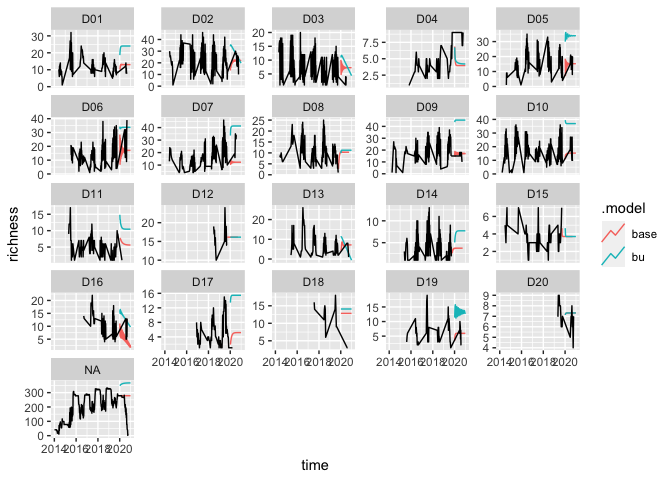
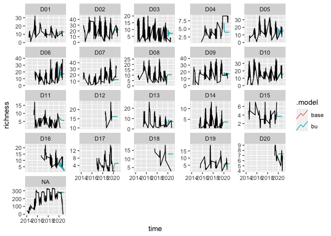

Hierarchical time series
================

``` r
library(tidyverse)
library(ISOweek) 
library(forecast)
library(fable)
library(tsibble)
library(tsibbledata)
library(lubridate)
library(dplyr)
```

Explore other simple forecasting methods

``` r
## Get the latest beetle target data.  
download.file("https://data.ecoforecast.org/targets/beetles/beetles-targets.csv.gz",
              "beetles-targets.csv.gz")
targets <-  read_csv("beetles-targets.csv.gz")
```

add an intermediate aggregation level

``` r
neon_sites <- read_csv("../NEON_Field_Site_Metadata.csv") %>%
  select(field_domain_id, field_site_id) %>%
  rename(siteID = field_site_id)
```

    ## 
    ## ── Column specification ────────────────────────────────────────────────────────
    ## cols(
    ##   .default = col_character(),
    ##   field_latitude = col_double(),
    ##   field_longitude = col_double(),
    ##   field_utm_northing = col_double(),
    ##   field_utm_easting = col_double(),
    ##   field_mean_elevation_m = col_double(),
    ##   field_minimum_elevation_m = col_double(),
    ##   field_maximum_elevation_m = col_double(),
    ##   field_mean_annual_temperature_C = col_double(),
    ##   field_mean_annual_precipitation_mm = col_double(),
    ##   field_watershed_size_km2 = col_double(),
    ##   field_lake_depth_mean_m = col_double(),
    ##   field_lake_depth_max_m = col_double(),
    ##   field_tower_height_m = col_double(),
    ##   field_avg_number_of_green_days = col_double(),
    ##   field_number_tower_levels = col_double()
    ## )
    ## ℹ Use `spec()` for the full column specifications.

``` r
targets <- targets %>%
  left_join(neon_sites, by = "siteID")
```

Make tsibble\! (richness data)

``` r
targets_ts <- targets %>%
  select(siteID, time, field_domain_id, richness) %>%
  mutate(iso_week = ISOweek::date2ISOweek(time)) %>%
  separate(iso_week, into = c("year", "week", "day")) %>%
  mutate(time = as.Date(time)) #%>%
 # mutate(time = yearmonth(time)) %>% #month year to start...
 # group_by(time, siteID) %>%
 # summarise(richness = mean(richness, na.rm = TRUE))
  #separate(iso_week, into = c("year", "week", "day")) %>%
  # filter(siteID %in% c("DSNY", "OSBS"))

targets_tsb_all <- as_tsibble(targets_ts, key = siteID, index = time)
```

Still need to sort out how we want to deal with data gaps…

``` r
richness_all <- targets_tsb_all %>%
  fill_gaps() %>%
  tidyr::fill(richness, .direction = "down") %>%
  aggregate_key(field_domain_id/siteID, richness = sum(richness))  #aggregation
```

``` r
fit <- richness_all %>%
  fill_gaps() %>%
  filter(year(time) <= 2019) %>%
  model(base = ARIMA(richness)) %>%
  reconcile(
    bu = bottom_up(base))
    #ols = min_trace(base, method = "ols"),
    #td = top_down(base, method = "proportion_averages"),
  #)
```

``` r
fc <- fit %>% forecast(h = "1 year")
```

``` r
fc %>%
  filter(!is_aggregated(field_domain_id), is_aggregated(siteID)) %>%
  autoplot(
    richness_all %>% filter(year(time) >= 2014),
    level = NULL
  ) +
  labs(y = "richness") +
  facet_wrap(vars(field_domain_id), scales = "free_y")
```

<!-- -->

``` r
fc %>%
  filter(is_aggregated(field_domain_id), is_aggregated(siteID)) %>%
  accuracy(
    data = richness_all,
    measures = list(rmse = RMSE, mase = MASE)
  ) %>%
  group_by(.model) %>%
  summarise(rmse = mean(rmse), mase = mean(mase))
```

    ## Warning: The future dataset is incomplete, incomplete out-of-sample data will be treated as missing. 
    ## 11 observations are missing between 2020-10-19 and 2020-12-28

    ## `summarise()` ungrouping output (override with `.groups` argument)

    ## # A tibble: 2 x 3
    ##   .model  rmse  mase
    ##   <chr>  <dbl> <dbl>
    ## 1 base    89.4  3.75
    ## 2 bu     503.  38.7

Suppose we want aggregate and domain forecasts for the richness, but we
aren’t interested in disaggregations using siteID.

create a simple tsibble object containing only state and national trip
totals for each quarter.

Still need to sort out how we want to deal with data gaps…

``` r
richness_all <- targets_tsb_all %>%
  fill_gaps() %>%
  tidyr::fill(richness, .direction = "down") %>%
  aggregate_key(field_domain_id, richness = sum(richness))  #aggregation
```

``` r
fit <- richness_all %>%
  fill_gaps() %>%
  filter(year(time) <= 2019) %>%
  model(base = ARIMA(richness)) %>%
  reconcile(
    bu = bottom_up(base))
    #ols = min_trace(base, method = "ols"),
    #td = top_down(base, method = "proportion_averages"),
  #)
```

``` r
fc <- fit %>% forecast(h = "1 year")
```

``` r
fc %>%
  filter(!is_aggregated(field_domain_id)) %>%
  autoplot(
    richness_all %>% filter(year(time) >= 2014),
    level = NULL
  ) +
  labs(y = "richness") +
  facet_wrap(vars(field_domain_id), scales = "free_y")
```

<!-- -->

``` r
fc %>%
  filter(is_aggregated(field_domain_id)) %>%
  accuracy(
    data = richness_all,
    measures = list(rmse = RMSE, mase = MASE)
  ) %>%
  group_by(.model) %>%
  summarise(rmse = mean(rmse), mase = mean(mase))
```

    ## Warning: The future dataset is incomplete, incomplete out-of-sample data will be treated as missing. 
    ## 11 observations are missing between 2020-10-19 and 2020-12-28

    ## `summarise()` ungrouping output (override with `.groups` argument)

    ## # A tibble: 2 x 3
    ##   .model  rmse  mase
    ##   <chr>  <dbl> <dbl>
    ## 1 base    89.4  3.75
    ## 2 bu     254.  18.7

General steps:

1)  Begin with a tsibble object (here labelled data) containing the
    individual bottom-level series.
2)  Define in aggregate\_key() the aggregation structure and build a
    tsibble object that also contains the aggregate series.
3)  Identify a model() for each series, at all levels of aggregation.
    Specify in reconcile() how the coherent forecasts are to be
    generated from the selected models.
4)  Use the forecast() function to generate forecasts for the whole
    aggregation structure.

# Top down approaches

# Bottom up approaches:

Suppose we want aggregate and domain forecasts for the richness, but we
aren’t interested in disaggregations using siteID.

create a simple tsibble object containing only state and national trip
totals for each quarter.

``` r
richness_domains <- targets_tsb_all %>%
  aggregate_key(field_domain_id, richness = sum(richness)) %>%
  fill_gaps() %>%
  tidyr::fill(richness, .direction = "down") 
```

generate the bottom-level state forecasts first, and then sum them to
obtain the aggregate forecasts:

The reconcile() step created a new “model” to produce bottom-up
forecasts.

The fable object contains the ets forecasts as well as the coherent bu
forecasts, for each of the domains and the aggregate. At the domain
level, these forecasts are identical, but the national arima forecasts
will be different from the national bu forecasts.

For bottom-up forecasting, this is rather inefficient as we are not
interested in the ETS model for the national total, and the resulting
fable contains a lot of duplicates.
