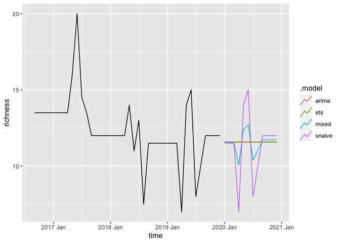
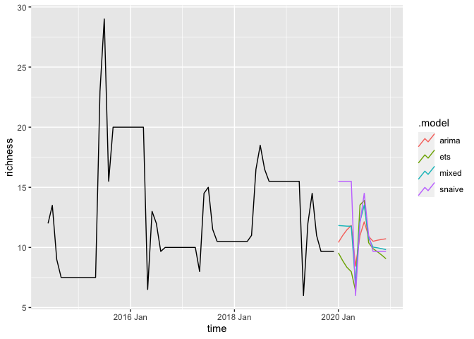

simple forecasting methods
================
Millie Chapman
2/16/2021

``` r
library(tidyverse)
library(ISOweek) 
library(forecast)
library(fable)
library(tsibble)
library(tsibbledata)
library(lubridate)
library(dplyr)
```

Explore other simple forecasting methods

``` r
## Get the latest beetle target data.  
download.file("https://data.ecoforecast.org/targets/beetles/beetles-targets.csv.gz",
              "beetles-targets.csv.gz")
targets <-  read_csv("beetles-targets.csv.gz")
```

Make tsibble\! (richness data)

``` r
targets_ts <- targets %>%
  select(siteID, time, richness) %>%
  mutate(iso_week = ISOweek::date2ISOweek(time)) %>%
  mutate(time = as.Date(time)) %>%
  mutate(time = yearmonth(time)) %>% #month year to start...
  group_by(time, siteID) %>%
  summarise(richness = mean(richness, na.rm = TRUE))
```

    ## `summarise()` regrouping output by 'time' (override with `.groups` argument)

``` r
  #separate(iso_week, into = c("year", "week", "day")) %>%
  # filter(siteID %in% c("DSNY", "OSBS"))

targets_tsb <- as_tsibble(targets_ts, key = siteID, index = time)
```

``` r
targets_tsb <- targets_tsb %>%
  group_by_key() %>%
  fill_gaps() %>%
  tidyr::fill(richness, .direction = "down") %>%
  filter(year(time) < 2020)
```

Mean
    forecast:

\[\hat{Y}_{T+h|T} = \bar{Y}\]

``` r
targets_tsb %>% model(MEAN(targets_tsb))
```

    ## Warning in mean.default(y, na.rm = TRUE): argument is not numeric or logical:
    ## returning NA
    
    ## Warning in mean.default(y, na.rm = TRUE): argument is not numeric or logical:
    ## returning NA
    
    ## Warning in mean.default(y, na.rm = TRUE): argument is not numeric or logical:
    ## returning NA
    
    ## Warning in mean.default(y, na.rm = TRUE): argument is not numeric or logical:
    ## returning NA
    
    ## Warning in mean.default(y, na.rm = TRUE): argument is not numeric or logical:
    ## returning NA
    
    ## Warning in mean.default(y, na.rm = TRUE): argument is not numeric or logical:
    ## returning NA
    
    ## Warning in mean.default(y, na.rm = TRUE): argument is not numeric or logical:
    ## returning NA
    
    ## Warning in mean.default(y, na.rm = TRUE): argument is not numeric or logical:
    ## returning NA
    
    ## Warning in mean.default(y, na.rm = TRUE): argument is not numeric or logical:
    ## returning NA
    
    ## Warning in mean.default(y, na.rm = TRUE): argument is not numeric or logical:
    ## returning NA
    
    ## Warning in mean.default(y, na.rm = TRUE): argument is not numeric or logical:
    ## returning NA
    
    ## Warning in mean.default(y, na.rm = TRUE): argument is not numeric or logical:
    ## returning NA
    
    ## Warning in mean.default(y, na.rm = TRUE): argument is not numeric or logical:
    ## returning NA
    
    ## Warning in mean.default(y, na.rm = TRUE): argument is not numeric or logical:
    ## returning NA
    
    ## Warning in mean.default(y, na.rm = TRUE): argument is not numeric or logical:
    ## returning NA
    
    ## Warning in mean.default(y, na.rm = TRUE): argument is not numeric or logical:
    ## returning NA
    
    ## Warning in mean.default(y, na.rm = TRUE): argument is not numeric or logical:
    ## returning NA
    
    ## Warning in mean.default(y, na.rm = TRUE): argument is not numeric or logical:
    ## returning NA
    
    ## Warning in mean.default(y, na.rm = TRUE): argument is not numeric or logical:
    ## returning NA
    
    ## Warning in mean.default(y, na.rm = TRUE): argument is not numeric or logical:
    ## returning NA
    
    ## Warning in mean.default(y, na.rm = TRUE): argument is not numeric or logical:
    ## returning NA
    
    ## Warning in mean.default(y, na.rm = TRUE): argument is not numeric or logical:
    ## returning NA
    
    ## Warning in mean.default(y, na.rm = TRUE): argument is not numeric or logical:
    ## returning NA
    
    ## Warning in mean.default(y, na.rm = TRUE): argument is not numeric or logical:
    ## returning NA
    
    ## Warning in mean.default(y, na.rm = TRUE): argument is not numeric or logical:
    ## returning NA
    
    ## Warning in mean.default(y, na.rm = TRUE): argument is not numeric or logical:
    ## returning NA
    
    ## Warning in mean.default(y, na.rm = TRUE): argument is not numeric or logical:
    ## returning NA
    
    ## Warning in mean.default(y, na.rm = TRUE): argument is not numeric or logical:
    ## returning NA
    
    ## Warning in mean.default(y, na.rm = TRUE): argument is not numeric or logical:
    ## returning NA
    
    ## Warning in mean.default(y, na.rm = TRUE): argument is not numeric or logical:
    ## returning NA
    
    ## Warning in mean.default(y, na.rm = TRUE): argument is not numeric or logical:
    ## returning NA
    
    ## Warning in mean.default(y, na.rm = TRUE): argument is not numeric or logical:
    ## returning NA
    
    ## Warning in mean.default(y, na.rm = TRUE): argument is not numeric or logical:
    ## returning NA
    
    ## Warning in mean.default(y, na.rm = TRUE): argument is not numeric or logical:
    ## returning NA
    
    ## Warning in mean.default(y, na.rm = TRUE): argument is not numeric or logical:
    ## returning NA
    
    ## Warning in mean.default(y, na.rm = TRUE): argument is not numeric or logical:
    ## returning NA
    
    ## Warning in mean.default(y, na.rm = TRUE): argument is not numeric or logical:
    ## returning NA
    
    ## Warning in mean.default(y, na.rm = TRUE): argument is not numeric or logical:
    ## returning NA
    
    ## Warning in mean.default(y, na.rm = TRUE): argument is not numeric or logical:
    ## returning NA
    
    ## Warning in mean.default(y, na.rm = TRUE): argument is not numeric or logical:
    ## returning NA
    
    ## Warning in mean.default(y, na.rm = TRUE): argument is not numeric or logical:
    ## returning NA
    
    ## Warning in mean.default(y, na.rm = TRUE): argument is not numeric or logical:
    ## returning NA
    
    ## Warning in mean.default(y, na.rm = TRUE): argument is not numeric or logical:
    ## returning NA
    
    ## Warning in mean.default(y, na.rm = TRUE): argument is not numeric or logical:
    ## returning NA
    
    ## Warning in mean.default(y, na.rm = TRUE): argument is not numeric or logical:
    ## returning NA
    
    ## Warning in mean.default(y, na.rm = TRUE): argument is not numeric or logical:
    ## returning NA
    
    ## Warning in mean.default(y, na.rm = TRUE): argument is not numeric or logical:
    ## returning NA

    ## Warning: 47 errors (1 unique) encountered for MEAN(targets_tsb)
    ## [47] non-numeric argument to binary operator

    ## # A mable: 47 x 2
    ## # Key:     siteID [47]
    ##    siteID `MEAN(targets_tsb)`
    ##    <chr>              <model>
    ##  1 ABBY          <NULL model>
    ##  2 BARR          <NULL model>
    ##  3 BART          <NULL model>
    ##  4 BLAN          <NULL model>
    ##  5 BONA          <NULL model>
    ##  6 CLBJ          <NULL model>
    ##  7 CPER          <NULL model>
    ##  8 DCFS          <NULL model>
    ##  9 DEJU          <NULL model>
    ## 10 DELA          <NULL model>
    ## # … with 37 more rows

Naïve method

\[\hat{Y}_{T+h|T} = Y_T\]

``` r
targets_tsb %>% model(NAIVE(targets_tsb))
```

    ## Warning: 47 errors (1 unique) encountered for NAIVE(targets_tsb)
    ## [47] invalid time series parameters specified

    ## # A mable: 47 x 2
    ## # Key:     siteID [47]
    ##    siteID `NAIVE(targets_tsb)`
    ##    <chr>               <model>
    ##  1 ABBY           <NULL model>
    ##  2 BARR           <NULL model>
    ##  3 BART           <NULL model>
    ##  4 BLAN           <NULL model>
    ##  5 BONA           <NULL model>
    ##  6 CLBJ           <NULL model>
    ##  7 CPER           <NULL model>
    ##  8 DCFS           <NULL model>
    ##  9 DEJU           <NULL model>
    ## 10 DELA           <NULL model>
    ## # … with 37 more rows

Seasonal naïve
    method

\[\hat{Y}_{T+h|T} = Y_{T+h-m(k+1)}\]

``` r
targets_tsb %>% model(SNAIVE(targets_tsb ~ lag("year")))
```

    ## Warning: 47 errors (1 unique) encountered for SNAIVE(targets_tsb ~ lag("year"))
    ## [47] invalid time series parameters specified

    ## # A mable: 47 x 2
    ## # Key:     siteID [47]
    ##    siteID `SNAIVE(targets_tsb ~ lag("year"))`
    ##    <chr>                              <model>
    ##  1 ABBY                          <NULL model>
    ##  2 BARR                          <NULL model>
    ##  3 BART                          <NULL model>
    ##  4 BLAN                          <NULL model>
    ##  5 BONA                          <NULL model>
    ##  6 CLBJ                          <NULL model>
    ##  7 CPER                          <NULL model>
    ##  8 DCFS                          <NULL model>
    ##  9 DEJU                          <NULL model>
    ## 10 DELA                          <NULL model>
    ## # … with 37 more rows

Drift
    method:

``` r
targets_tsb %>% model(RW(targets_tsb ~ drift()))
```

    ## Warning: 47 errors (1 unique) encountered for RW(targets_tsb ~ drift())
    ## [47] invalid time series parameters specified

    ## # A mable: 47 x 2
    ## # Key:     siteID [47]
    ##    siteID `RW(targets_tsb ~ drift())`
    ##    <chr>                      <model>
    ##  1 ABBY                  <NULL model>
    ##  2 BARR                  <NULL model>
    ##  3 BART                  <NULL model>
    ##  4 BLAN                  <NULL model>
    ##  5 BONA                  <NULL model>
    ##  6 CLBJ                  <NULL model>
    ##  7 CPER                  <NULL model>
    ##  8 DCFS                  <NULL model>
    ##  9 DEJU                  <NULL model>
    ## 10 DELA                  <NULL model>
    ## # … with 37 more rows

Filling in NAs

``` r
train <- targets_tsb %>%
  group_by_key() %>%
  fill_gaps() %>%
  tidyr::fill(richness, .direction = "down") %>%
  filter(year(time) < 2020)
```

Trying a handful of models

``` r
fit <- train %>%
  model(
    ets = ETS(richness),
    arima = ARIMA(richness),
    snaive = SNAIVE(richness)
  ) %>%
  mutate(mixed = (ets + arima + snaive) / 3)
```

    ## Warning: 8 errors (1 unique) encountered for ets
    ## [8] ETS does not support missing values.

Forecast\!

``` r
fc <- fit %>%
  forecast(h = "12 months") 
```

``` r
fc %>%
  filter(siteID == "ABBY") %>%
  autoplot(train, level = NULL)
```

    ## `mutate_if()` ignored the following grouping variables:
    ## Column `siteID`

<!-- -->

``` r
fc %>%
  filter(siteID == "BART") %>%
  autoplot(train, level = NULL)
```

    ## `mutate_if()` ignored the following grouping variables:
    ## Column `siteID`

<!-- -->

``` r
fc_accuracy <- accuracy(fc, train,
  measures = list(
    point_accuracy_measures,
    interval_accuracy_measures,
    distribution_accuracy_measures
  )
)
```

    ## Warning: The future dataset is incomplete, incomplete out-of-sample data will be treated as missing. 
    ## 16 observations are missing between 2019 Sep and 2020 Dec

``` r
fc_accuracy %>%
  group_by(.model) %>%
  summarise(
    RMSE = mean(RMSE),
    MAE = mean(MAE),
    MASE = mean(MASE),
    Winkler = mean(winkler),
    CRPS = mean(CRPS)
  ) %>%
  arrange(RMSE)
```

    ## `summarise()` ungrouping output (override with `.groups` argument)

    ## # A tibble: 4 x 6
    ##   .model  RMSE   MAE  MASE Winkler  CRPS
    ##   <chr>  <dbl> <dbl> <dbl>   <dbl> <dbl>
    ## 1 arima    NaN   NaN   NaN     NaN   NaN
    ## 2 ets      NaN   NaN   NaN     NaN   NaN
    ## 3 mixed    NaN   NaN   NaN     NaN   NaN
    ## 4 snaive   NaN   NaN   NaN     NaN   NaN
